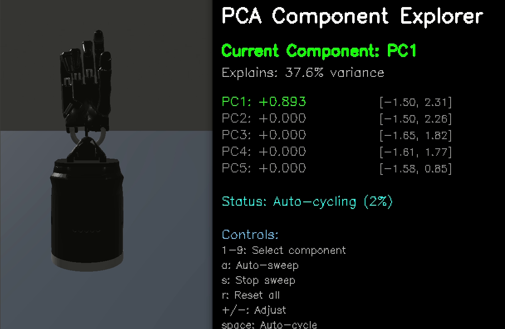

# Dexterous Synergy Analysis

A comprehensive toolkit for analyzing human hand movements using Principal Component Analysis (PCA) to identify and reconstruct hand synergies for robotic retargeting.

## Overview

This repository provides tools for:
- **Data Collection**: Record hand movements from live camera or video files
- **Synergy Analysis**: Apply PCA to discover principal components of hand motion
- **Component Exploration**: Interactively explore what each principal component controls
- **Real-time Reconstruction**: Use PCA to compress and reconstruct hand movements in real-time

## Quick Start

### 1. Installation

```bash
conda create -n dsa python=3.10
conda activate dsa 
pip install -e .
```

### 2. Data Collection (Optional)

Record hand movements with automatic saving:

```bash
python synergy_analysis/synergy_realtime_retargeting_save.py --robot-name {allegro,shadow,svh,leap,ability,inspire,panda} --retargeting-type {vector,position,dexpilot} --hand-type {right,left}
```

Or process existing video files of moving hand:

```bash
python synergy_analysis/synergy_realtime_retargeting_save.py --video {path/to/video.mp4} --robot-name {allegro,shadow,svh,leap,ability,inspire,panda} --retargeting-type {vector,position,dexpilot} --hand-type {right,left}
```

`--retargeting-type dexpilot` is recommended as default.

### 3. Analyze Recorded Data

Perform PCA analysis and view reconstruction quality:

```bash
python synergy_analysis/synergy_reconstruct.py --pkl-file {path/to/recorded_qpos.pkl} --robot-name {allegro,shadow,svh,leap,ability,inspire,panda} --retargeting-type {vector,position,dexpilot} --hand-type {right,left} --n-components <num>
```

A pre-recorded and shadow hand retargeted data is provided in `data/recorded_shadow_qpos_retargeted.pkl`, which can be used as
```bash
python synergy_analysis/synergy_reconstruct.py --pkl-file data/recorded_shadow_qpos_retargeted.pkl --robot-name shadow --retargeting-type dexpilot --hand-type right --n-components 8
```


> **Takeaway:** For a 22-DOF Shadow Hand, using **8 principal components** is typically sufficient to reconstruct hand movement patterns with high fidelity.


### 4. Explore Components

Interactively explore individual principal components:

```bash
python synergy_analysis/synergy_component_explorer.py --pkl-file data/recorded_shadow_qpos_retargeted.pkl --robot-name shadow --retargeting-type dexpilot --hand-type right --n-components 4
```
You will have windows poping up like this



### 5. Real-time Reconstruction

Use pre-trained PCA parameters for live reconstruction:

```bash
python synergy_analysis/synergy_realtime_reconstruct.py --pkl-file data/recorded_shadow_qpos_retargeted.pkl --robot-name shadow --retargeting-type dexpilot --hand-type right --n-components 8
```

## Workflow

The complete analysis workflow consists of:

1. **Data Collection** → Record qpos data with metadata
2. **PCA Analysis** → Extract principal components and analyze variance
3. **Component Exploration** → Understand what each PC controls
4. **Real-time Application** → Apply learned synergies to live data

## Documentation
Generated by claude-4-sonnet. 
- [`README_synergy_workflow.md`](synergy_analysis/README_synergy_workflow.md) - Complete workflow guide
- [`README_component_explorer.md`](synergy_analysis/README_component_explorer.md) - Component exploration tool
- [`README_realtime_synergy.md`](synergy_analysis/README_realtime_synergy.md) - Real-time reconstruction
- [`README_video_retargeting.md`](synergy_analysis/README_video_retargeting.md) - Video processing

## Key Features

- **Automated PCA Analysis**: Variance analysis, reconstruction error metrics
- **Interactive Visualization**: Real-time comparison of original vs reconstructed movements  
- **Component Exploration**: Slide individual PCs to understand their effects
- **Multi-format Support**: Live camera, MP4, AVI, MOV video processing
- **Research Integration**: Possible integration with existing learning pipelines

## Key Insights & Takeaways

### Dimensionality Reduction Effectiveness
- **For 16-22 DOF hands**: 4-8 principal components are typically sufficient for high-quality reconstruction
- **Reconstruction loss varies** with the number of PCs - more components generally improve accuracy but increase complexity
- **Sweet spot**: 5-6 components often provide the best balance between reconstruction quality and computational efficiency

### Applications in Learning Algorithms
- **Lower-level Policy Learning**: PCA-reduced control space would improve sample efficiency in Reinforcement Learning (RL)
- **Imitation Learning (IL)**: Reduced dimensionality makes demonstration learning more tractable for high-DOF hands


### Research Impact
Dimensionality reduction through hand synergies is particularly valuable for:
- **High-DOF robotic hands** (16+ joints) where traditional control methods struggle
- **Sample-efficient learning** where data collection is expensive or time-consuming
- **Real-time applications** requiring fast control loops and low latency

*Note: A comprehensive analysis of PC selection strategies and reconstruction quality across different hand models will be added to this repository.*


## Citation

```bibtex
@software{dex_synergy_analysis,
  title={Dexterous Synergy Analysis},
  author={Lixin Xu},
  year={2025},
  url={https://github.com/your-username/DexSynergyAnalysis}
}
```

## License

MIT License - see [LICENSE](LICENSE) for details.
